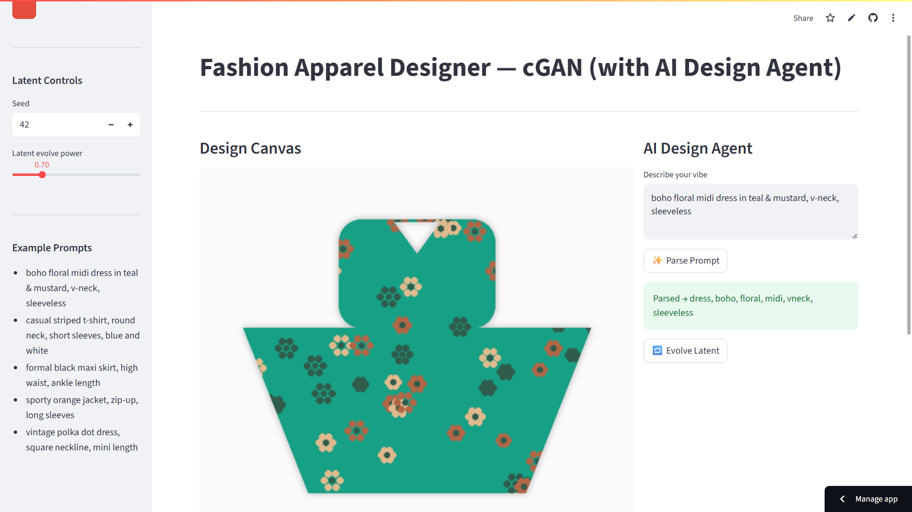

# Fashion Apparel Designer — cGAN (with AI Design Agent)

This repository contains a compact Streamlit app that procedurally generates apparel mockups (shirts, dresses, skirts, jackets, pants) and can optionally switch to a conditional GAN (cGAN) generator when you provide trained weights.

Features
- Procedural renderer that produces silhouette-aware patterns (solid, stripes, polka, floral, geometric, abstract).
- Small AI Design Agent that parses natural-language prompts into category + attributes and suggests palettes.
- Optional DCGAN-like conditional `Generator` class — drop trained weights to `weights/generator.pth` to enable ML mode.

Preview




Quick start (Windows / PowerShell)

1. (Optional) Create a virtual environment:

```powershell
python -m venv .venv; .\.venv\Scripts\Activate.ps1
```

2. Install dependencies (recommended):

```powershell
pip install -r requirements.txt
```

Or install minimal deps:

```powershell
pip install streamlit torch torchvision pillow numpy scikit-image
```

3. Run the app:

```powershell
streamlit run main.py
```

Notes
- To enable GAN mode place PyTorch weights at `weights/generator.pth`. The `Generator` class expects `nz=128` and `nclass` equal to the number of categories (default: 6).
- The app will automatically fall back to the procedural renderer when PyTorch isn't available or weights aren't present.

Files of interest
- `main.py` — Streamlit app, procedural renderer, prompt parser, and optional GAN code.
- `requirements.txt` — dependency hint file (auto-created if missing).
- `weights/` — optional: put `generator.pth` here to enable cGAN sampling.
- `assest/` — local image assets and examples (note: folder name reflects existing repo layout).

Extending the project
- Add more categories, patterns or improve silhouette masks in `garment_mask`.
- Replace procedural silhouettes with SVG tech-packs for higher-fidelity output.
- Hook up CLIP or other text-image scoring to refine/optimise latents against prompts.

License & credits

MIT-style permissive use. Built as a compact demo to help prototype fashion design workflows locally.

---

If you'd like, I can also:
- Add a more detailed contributing section.
- Generate PNG screenshots (instead of SVG) or add additional example images.
- Create a `README.md` (lowercase) as well for common tooling compatibility.
